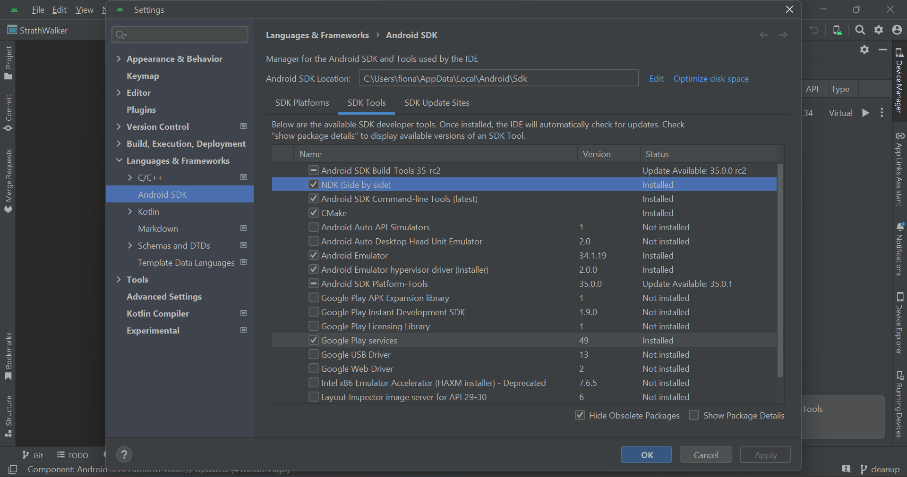

# StrathWalk 
The StrathWalk app aims to get students at Strathclyde healthier and more relaxed by showing them walks they can do 
between classes.

This is a [**React Native**](https://reactnative.dev) project, bootstrapped using [`@react-native-community/cli`](https://github.com/react-native-community/cli).

This app uses Google Maps Platform API Routes services. Use of Google Maps Platform services through this app is subject to the Google Maps Platform's [Terms of Use](https://cloud.google.com/maps-platform/terms/) and [Privacy Policy](https://policies.google.com/privacy).

Routes and polylines generated by this app were Powered by Google, ©2024 Google. 

# Installing the App

## Development Build

>**Note**: Make sure you have completed the [React Native - Environment Setup](https://reactnative.dev/docs/environment-setup) instructions till "Creating a new application" step, before proceeding.

### Step 1: Clone the repository
Please clone the repository onto your machine so you have all the files to run the app. 

### Step 2: Install Dependencies

To install the app's dependencies, run...

```bash
npm install --legacy-peer-deps
```

**A NDK will be needed and although this should download automatically with this command, if it does not, you can download the NDK by going on Android Studio and then going to ``Setting > SDK Manager > SDK Tools`` and installing ``NDK (Side by side)``**


### Step 3: Start the Application

To start the application, run...

```bash
# 
npx react-native start --reset-cache
```

The reset cache option is needed for ensuring our Nativewind styling works and the app appears as it should


# Libraries Used

- Adel Reda (2023) react-native-select-dropdown, npm. Available at: https://www.npmjs.
com/package/react-native-select-dropdown (Accessed: 24 February 2024).
- Angela Yu and google-wombot (2022) @googlemaps/polyline-codec, npm. Available at: https://www.npmjs.
com/package/@googlemaps/polyline-codec (Accessed: 21 March 2024).
- Brie B et al. (2024) react-native-maps, npm. Available at: https://www.npmjs.com/package/react-native-maps 
(Accessed: 24 February 2024).
callstack (2024) React Native Paper. Available at: https://reactnativepaper.com/ (Accessed: 24 February 2024).
- Esa-Matti Suuronen and dschmidt (2022) react-native-sensors, npm. Available at: https://www.npmjs.
com/package/react-native-sensors (Accessed: 21 March 2024).
- firoframe (2023) react-native-compass-heading, npm. Available at: https://www.npmjs.
com/package/react-native-compass-heading (Accessed: 21 March 2024).
- Invertase (2023) Notifee, Notifee. Available at: https://notifee.app/ (Accessed: 21 March 2024).
- krizzu (2024) @react-native-async-storage/async-storage, npm. Available at: https://www.npmjs.com/package/@react-native-async-storage/async-storage (Accessed: 21 March 2024).
- Mark Lawlor (2023) NativeWind. Available at: https://nativewind.dev/ (Accessed: 24 February 2024).
- oblador (2023) react-native-vector-icons, npm. Available at: https://www.npmjs.com/package/react-native-vector-icons (Accessed: 21 March 2024).
- React Navigation (2024) React Navigation. Available at: https://reactnavigation.org/ (Accessed: 24 February 2024).
- Software Mansion (2023) React Native Reanimated. Available at: https://docs.swmansion.com/react-native-reanimated/ (Accessed: 21 March 2024).
- Web Ridge (2024) Paper Dates. Available at: https://web-ridge.github.io/react-native-paper-dates/ (Accessed: 24 February 2024).

